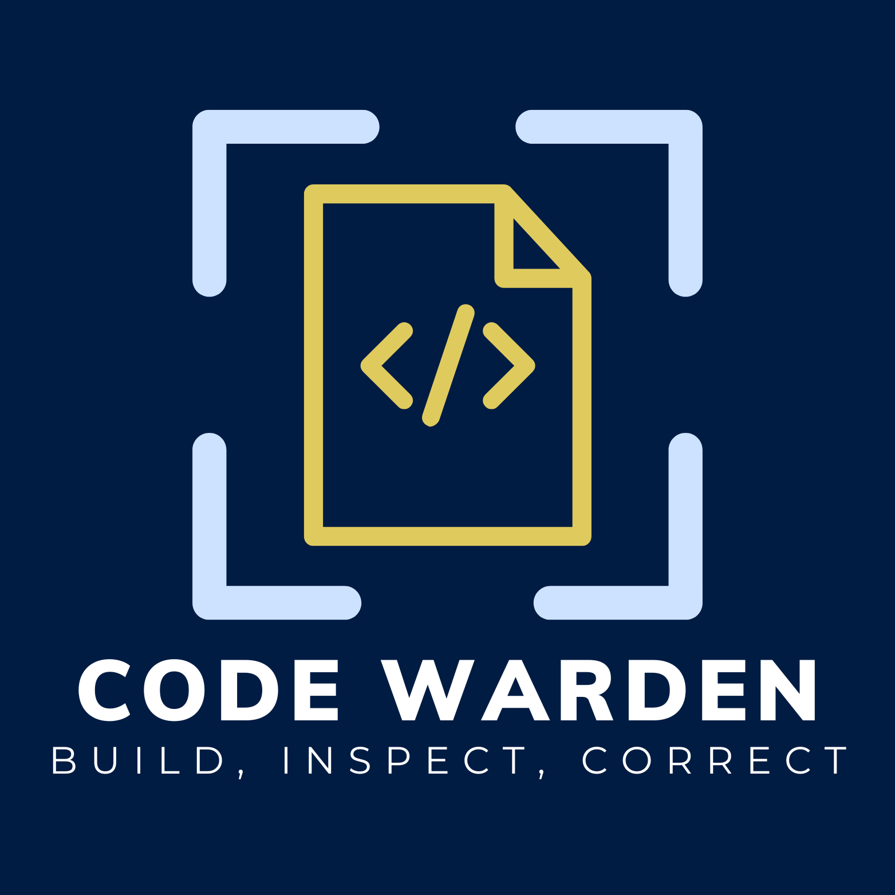

[](https://codewarden.ai)


# [codewarden.ai](https://codewarden.ai) GitHub Action


This action will analyze your pull request code using [Code Warden](https://codewarden.ai) against the requirements detailed in your Jira ticket

---
## Getting Started

In order to use this action you will require:

1. Jira Data Center edition
2. The Jira [Code Warden plugin](https://marketplace.atlassian.com/) installed from the Atlassian Marketplace onto your Jira Data Center edition instance

---
## Usage

```yaml

name: Code Warden In Action

on:
  pull_request:
    branches:
      - main

permissions:
  contents: read
  pull-requests: write
 
jobs:
  codewarden-test:
    runs-on: ubuntu-latest
   
    steps:
      - name: Checkout code
        uses: actions/checkout@v3
      
      - name: Code Warden Analyze
        uses: rootedconcepts/codewarden-action@v1
        with:
          github-token: ${{ secrets.GITHUB_TOKEN }}
          jira-url : "https://myjira.com"
          jira-user: ${{ secrets.JIRA_USER }}
          jira-password: ${{ secrets.JIRA_PWD }}
```
---
## Inputs   

### `github-token`

**Required** - A token to access the PR detail within the Git repo. This is required for Code Warden to be able to post a comment on the PR and read files associated with the PR for analysis.

### `jira-url`

**Required** - The URL of your Jira instance which has the Code Warden plugin installed.

### `jira-user`

**Required** - The user name to login to the Jira instance.

### `jira-password`

**Required** - The password for the user to login to the Jira instance.

### `comment-language`

**Optional** - The language you want to display the Code Warden analysis in.
